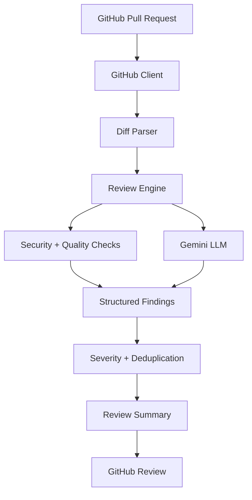

# AI Code Reviewer Architecture

## Overview

This project combines the upstream PR-Agent review engine with an original orchestration layer that focuses on GitHub-native PR review, structured findings, security classification, and automated CI execution.

## Components

- GitHub client: retrieves PR metadata, changed files, and diff payloads.
- Diff parser: normalizes unified diff text into reviewable entries and filters irrelevant files.
- Review engine: coordinates local checks and LLM-based analysis.
- LLM layer: wraps Gemini and can later support other providers.
- Severity engine: classifies findings by severity and category.
- Formatter: converts the result into a review summary readable by GitHub.

## Data flow

## Security model

- Secrets are never committed.
- Environment variables are used for token injection.
- GitHub Action permissions are minimal.
- Logging avoids printing raw credentials or tokens.

## Deployment model

The repository supports local execution, Docker-based execution, and GitHub Actions automation.
